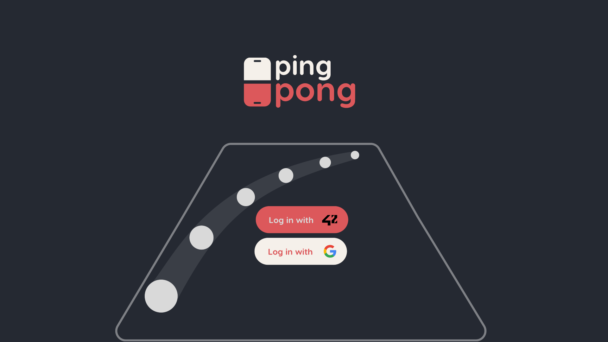
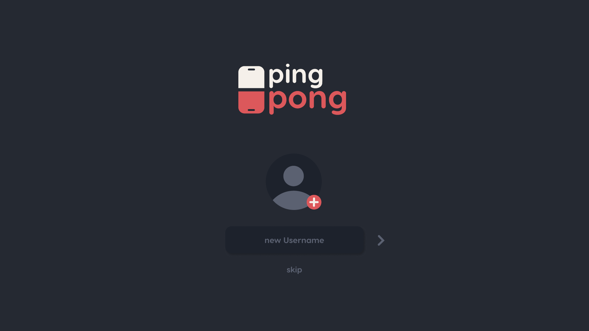
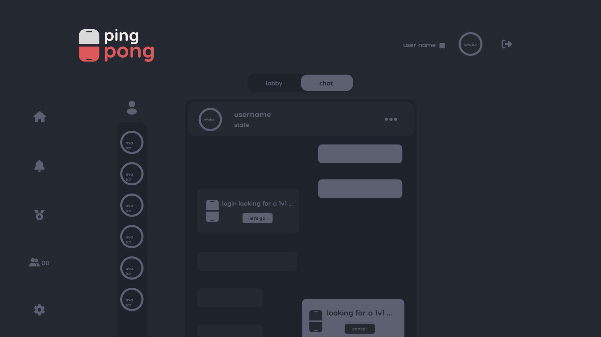
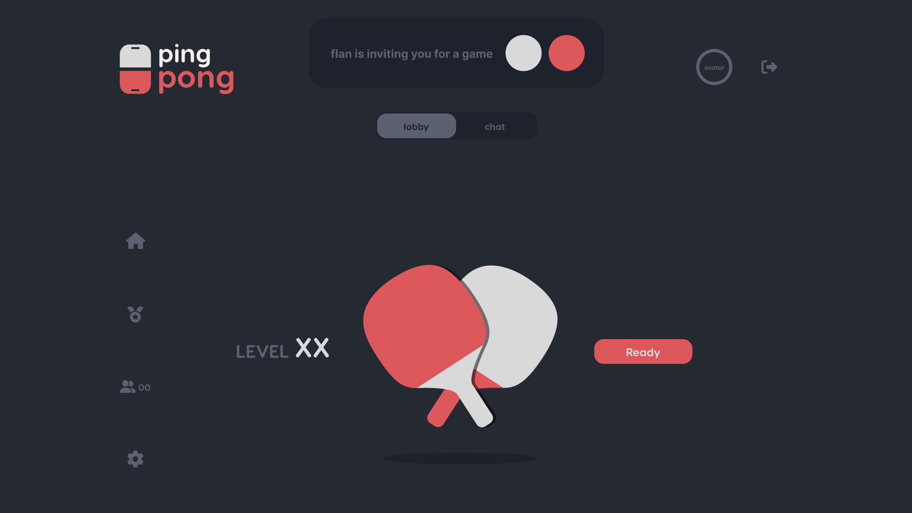
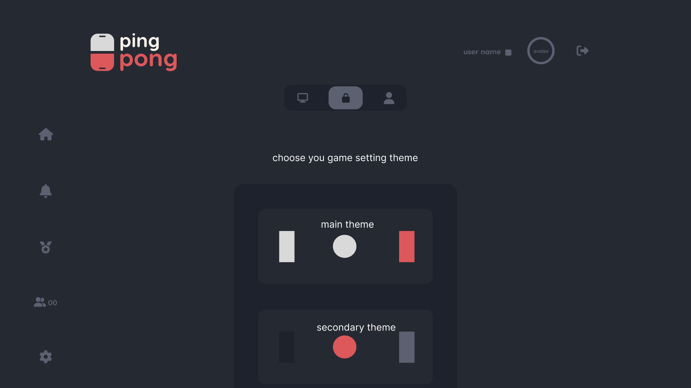
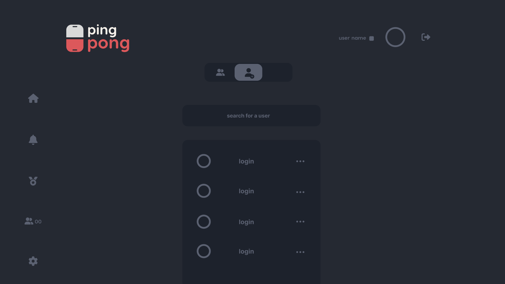
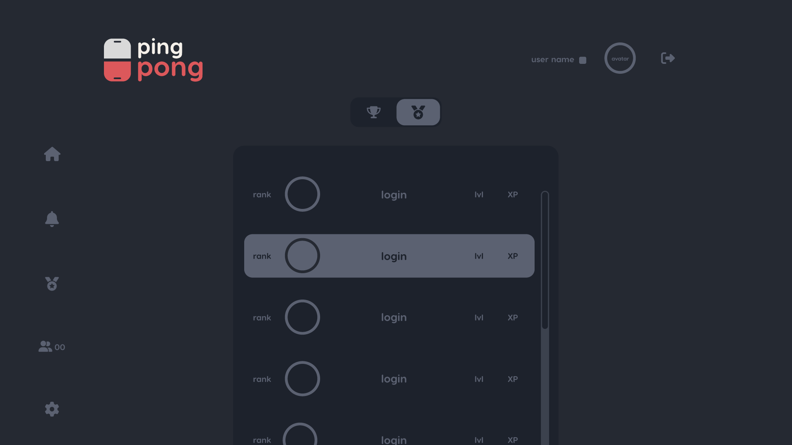

# Pong Game

Pong Game it's a web application, The project focused on 3 main things:
It's a social pong game where the user can play pong game with other users,
Having other users as a friend, chatting with them, and creating channels, with a user interface, you can see the user stats, friends, achievements, and other functionalities.

## Tech Stack
### BackEnd: NestJs
### FrontEnd:NextJs
### DATABASE: PostgresSQL
### Containerzation: Docker
### ORM: Prisma

  
  
  
  
  
  
  

